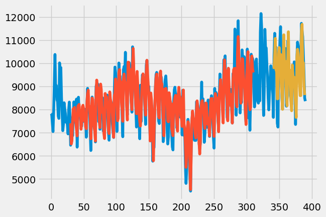
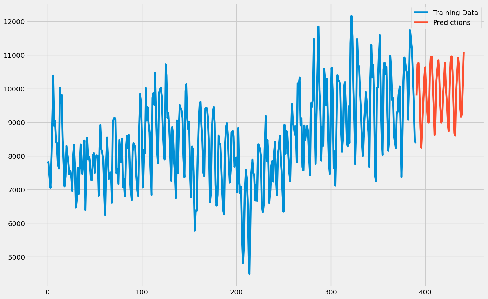

# Website Traffic Prediction

## Project Overview

This project aims to predict website traffic using machine learning algorithms. The project reads data from an Excel sheet containing daily website traffic information. It then uses this data to train and test a machine learning model, which predicts future website traffic. The project also demonstrates the traffic data using charts, showing both the trained and tested data, as well as the predicted traffic.

## Tech Stack

- **Python**: For the main application logic.
- **pandas**: For data manipulation and analysis.
- **matplotlib**: For creating static plots.
- **plotly**: For creating interactive plots.
- **statsmodels**: For statistical modeling and time series analysis.
- **tensorflow**: For machine learning.
- **scikit-learn**: For data preprocessing and model evaluation.

## Features

- **Data Reading**: Reads website traffic data from an Excel sheet.
- **Data Visualization**: Visualizes the actual traffic data and the predicted traffic using various charts.
- **Traffic Prediction**: Predicts future website traffic using trained machine learning models.
- **Interactive Plots**: Provides interactive plots for better data analysis and visualization.

## Project Setup

### Prerequisites

- Python 3.x
- pandas
- matplotlib
- plotly
- statsmodels
- tensorflow
- scikit-learn

### Installation

1. **Clone the repository**:
    ```sh
    git clone <repository-url>
    cd Website-Traffic-Prediction
    ```

2. **Install the required dependencies**:
    ```sh
    pip install pandas matplotlib plotly statsmodels tensorflow scikit-learn
    ```

### Running the Application

1. **Run the main script**:
    ```sh
    python main.py
    ```


### Explanation of Files

- `env/`: Contains the virtual environment files.
- `data/website_traffic.xlsx`: Contains the website traffic data.
- `plots/`: Contains the generated plot images.
- `main.py`: The main Python script for the project.
- `requirements.txt`: Lists the dependencies required for the project.

## Usage

1. **Prepare the Data**:
    - Ensure the Excel sheet (`website_traffic.xlsx`) is placed in the `data/` directory.
    - The Excel sheet should contain a single column with daily website traffic data.

2. **Run the Script**:
    - The script will read the data, preprocess it, train the model, and make predictions.
    - It will also generate various plots showing the actual and predicted traffic.

3. **View the Plots**:
    - The generated plots will be saved in the `plots/` directory.
    - You can view these plots to analyze the website traffic and the predictions.

## Example Plots

### Train vs Test Traffic



### Predicted Traffic Continuation



## Contributing

Contributions are welcome! Please open an issue or submit a pull request.

## License

This project is licensed under the MIT License.


